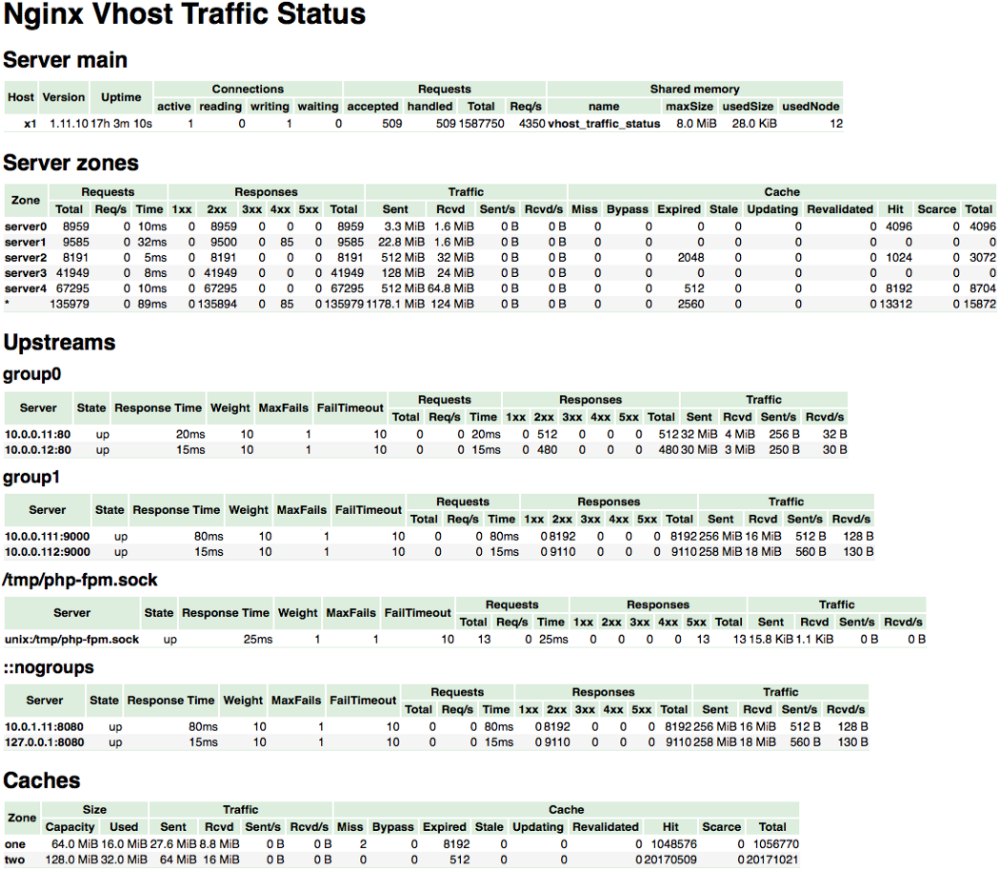
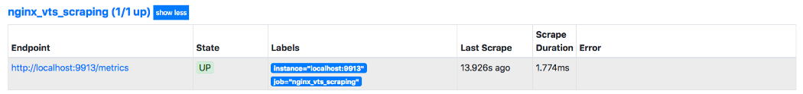

# Nginx VTS Exporter and Prometheus
Nginx VTS Exporter will expose the metrics and these metrics will be formed into api endpoint which will be consumed by promethues server finally

How to Do it?
------

## Step 1: Compile Nginx with virtual host traffic status module ( nginx_vts_module )

Download and unpack the sources of the latest version of Nginx
```
cd /opt/ \
    && wget https://nginx.org/download/nginx-1.13.5.tar.gz \
    && tar xf nginx-1.13.5.tar.gz
```
Get the latest stable version code of the nginx-module-vts
```
curl -fSL https://github.com/vozlt/nginx-module-vts/archive/v0.1.15.tar.gz | tar xzf - -C /tmp
```

Other installations
```
apt–get install libpcre3
apt–get install libpcre3–dev
sudo apt install zlib1g
sudo apt install zlib1g-dev
sudo apt install build-essential checkinstall zlib1g-dev -y
sudo apt-get install -y — no-install-suggests libluajit-5.1-dev libpam0g-dev zlib1g-dev libpcre3-dev libssl-dev libluajit-5.1-dev libpam0g-dev zlib1g-dev libpcre3-dev libexpat1-dev git curl build-essential
```
Compile Nginx from source with required modules
```
./configure \
    --prefix=/etc/nginx \
    --sbin-path=/usr/sbin/nginx \
    --modules-path=/usr/lib/nginx/modules \
    --conf-path=/etc/nginx/nginx.conf \
    --error-log-path=/var/log/nginx/error.log \
    --http-log-path=/var/log/nginx/access.log \
    --pid-path=/var/run/nginx.pid \
    --lock-path=/var/run/nginx.lock \
    --http-client-body-temp-path=/var/cache/nginx/client_temp \
    --http-proxy-temp-path=/var/cache/nginx/proxy_temp \
    --http-fastcgi-temp-path=/var/cache/nginx/fastcgi_temp \
    --http-uwsgi-temp-path=/var/cache/nginx/uwsgi_temp \
    --http-scgi-temp-path=/var/cache/nginx/scgi_temp \
    --user=nginx \
    --group=nginx \
    --with-http_ssl_module \
    --with-http_realip_module \
    --with-http_addition_module \
    --with-http_sub_module \
    --with-http_dav_module \
    --with-http_flv_module \
    --with-http_gunzip_module \
    --with-http_gzip_static_module \
    --with-http_random_index_module \
    --with-http_secure_link_module \
    --with-http_stub_status_module \
    --with-http_auth_request_module \
    --with-threads --with-stream \
    --with-stream_ssl_module \
    --with-http_slice_module \
    --with-mail \
    --with-mail_ssl_module \
    --with-file-aio \
    --with-http_v2_module \
    --with-cc-opt='-g -O2 -fstack-protector-strong -Wformat -Werror=format-security -Wp,-D_FORTIFY_SOURCE=2' \
    --with-ld-opt='-Wl,-Bsymbolic-functions -Wl,-z,relro -Wl,--as-needed' \
    --add-module=/tmp/nginx-module-vts-0.1.15
```

Finally
```
make
make install
service nginx restart
```
## Step 2. Location opening for researching metrics
In the http section of the /etc/nginx/nginx.conf configuration file, add the following line
```
http {
    vhost_traffic_status_zone;
    ... 
}
```
```
server {
 listen 8080;
 listen [::]:8080;
 location / {
 }
 location /status {
   vhost_traffic_status_display;
   vhost_traffic_status_display_format html; 
 }
}
```
By the way, if you going to deny any outside requests and open location only for internal server scraping you could add some lines. It is optional for start.
```
...
location /status {
...
  allow any_ip_address; # E.g. localhost ip address
  deny all; 
}
...
```

As a result, going to xxx.xxx.xxx.xxx:8080/status should discover a similar interface:



## Step 3. Golang installation and launch mini-server for exporter

Download go binary from source or directly. At the time of this writing, the last stable version was v0.10.4
```
wget https://github.com/hnlq715/nginx-vts-exporter/archive/v0.10.4.tar.gz
tar -xzvf v0.10.4.tar.gz
cd nginx-vts-exporter-0.10.4/bin
go install nginx_vts_exporter.go
sudo cp $GOPATH/bin/nginx_vts_exporter /usr/local/bin
sudo useradd — no-create-home — shell /bin/false nginx_vts_exporter
sudo touch /etc/systemd/system/nginx_vts_exporter.service
```
Put this in the file
```
[Unit]
Description=Nginx vts exporter  
Wants=network-online.target
After=network-online.target
[Service]
User=nginx_vts_exporter
Group=nginx_vts_exporter
ExecStart=/usr/local/bin/nginx_vts_exporter -nginx.scrape_uri=http://localhost:8080/status/format/json
Restart=always
RestartSec=3
[Install]
WantedBy=default.target
```
Finally
```
sudo systemctl daemon-reload
sudo systemctl enable nginx_vts_exporter
sudo systemctl start nginx_vts_exporter
sudo systemctl status nginx_vts_exporter
```
You can get the metrics exposed in 9913 port


Add your scrape config and you are done 
```
scrape_configs:
  — job_name: ‘prometheus’
    # leave it unchanged
  — job_name: ‘nginx_vts_exporter’
    # metrics_path defaults to '/metrics'
    # scheme defaults to 'http'.
    static_configs:
    — targets: [‘xxx.xxx.xxx.xxx:9913’]
```


