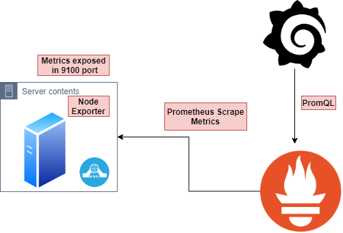

# Node Exporter and Prometheus for Server Stats

Prometheus exporter for hardware and OS metrics exposed by *NIX kernels, written in Go with pluggable metric collectors. This collects all the crucial information in depth and letting us customize the metrcis we need.

### Promethues Server Architecture


### Node Exporter Architecture




Installing Node Exporter
----

The Prometheus Node Exporter is a single static binary that you can install via tarball. Once you've downloaded it from the Prometheus downloads page extract it, and run it:
```
wget https://github.com/prometheus/node_exporter/releases/download/v*/node_exporter-*.*-amd64.tar.gz
tar xvfz node_exporter-*.*-amd64.tar.gz
cd node_exporter-*.*-amd64
./node_exporter
```

Once the Node Exporter is installed and running, you can verify that metrics are being exported by cURLing the /metrics endpoint:

```
curl http://localhost:9100/metrics
```

Glimpse of how metrics looks like
----

**CPU Stats**
```
# HELP node_cpu_seconds_total Seconds the cpus spent in each mode.
# TYPE node_cpu_seconds_total counter
node_cpu_seconds_total{cpu="0",mode="idle"} 48649.88
node_cpu_seconds_total{cpu="0",mode="iowait"} 169.99
node_cpu_seconds_total{cpu="0",mode="irq"} 0
node_cpu_seconds_total{cpu="0",mode="nice"} 57.5
node_cpu_seconds_total{cpu="0",mode="softirq"} 8.05
node_cpu_seconds_total{cpu="0",mode="steal"} 0
node_cpu_seconds_total{cpu="0",mode="system"} 1058.32
node_cpu_seconds_total{cpu="0",mode="user"} 4234.94
node_cpu_seconds_total{cpu="1",mode="idle"} 9413.55
node_cpu_seconds_total{cpu="1",mode="iowait"} 57.41
node_cpu_seconds_total{cpu="1",mode="irq"} 0
node_cpu_seconds_total{cpu="1",mode="nice"} 46.55
node_cpu_seconds_total{cpu="1",mode="softirq"} 7.58
node_cpu_seconds_total{cpu="1",mode="steal"} 0
node_cpu_seconds_total{cpu="1",mode="system"} 1034.82
node_cpu_seconds_total{cpu="1",mode="user"} 4285.06
```
**Disk Stats**
```
# HELP node_disk_io_now The number of I/Os currently in progress.
# TYPE node_disk_io_now gauge
node_disk_io_now{device="sda"} 0

node_disk_io_now
The number of I/Os in progress.

node_disk_io_time_seconds_total
Incremented when I/O is in progress.

node_disk_read_bytes_total
Bytes read by I/Os.

node_disk_read_time_seconds_total
The time taken by read I/Os.

node_disk_reads_completed_total
The number of complete I/Os.

node_disk_written_bytes_total
Bytes written by I/Os.

node_disk_write_time_seconds_total
The time taken by write I/Os.

node_disk_writes_completed_total
The number of complete write I/Os.
```
**File System**
```
# HELP node_filesystem_avail_bytes Filesystem space available to non-root users in bytes.
# TYPE node_filesystem_avail_bytes gauge
node_filesystem_avail_bytes{device="/dev/mapper/vg1-lv_root",fstype="ext4",mountpoint="/"} 2.0224393216e+10

# HELP node_filesystem_device_error Whether an error occurred while getting statistics for the given device.
# TYPE node_filesystem_device_error gauge
node_filesystem_device_error{device="/dev/mapper/vg1-lv_root",fstype="ext4",mountpoint="/"} 0

# HELP node_filesystem_files Filesystem total file nodes.
# TYPE node_filesystem_files gauge
node_filesystem_files{device="/dev/mapper/vg1-lv_root",fstype="ext4",mountpoint="/"} 1.671168e+06

```
**Load average**
```
# HELP node_load1 1m load average.
# TYPE node_load1 gauge
node_load1 0
# HELP node_load15 15m load average.
# TYPE node_load15 gauge
node_load15 0
# HELP node_load5 5m load average.
# TYPE node_load5 gauge
node_load5 0
```
**Netstat**
```
# HELP node_netstat_Icmp_InErrors Statistic IcmpInErrors.
# TYPE node_netstat_Icmp_InErrors untyped
node_netstat_Icmp_InErrors 808

# HELP node_netstat_Icmp_InMsgs Statistic IcmpInMsgs.
# TYPE node_netstat_Icmp_InMsgs untyped
node_netstat_Icmp_InMsgs 147294

# HELP node_netstat_Icmp_OutMsgs Statistic IcmpOutMsgs.
# TYPE node_netstat_Icmp_OutMsgs untyped
node_netstat_Icmp_OutMsgs 2.287623e+06

# HELP node_netstat_IpExt_InOctets Statistic IpExtInOctets.
# TYPE node_netstat_IpExt_InOctets untyped
node_netstat_IpExt_InOctets 8.9438844307199e+13

# HELP node_netstat_IpExt_OutOctets Statistic IpExtOutOctets.
# TYPE node_netstat_IpExt_OutOctets untyped
node_netstat_IpExt_OutOctets 7.2850849351548e+13

# HELP node_netstat_Ip_Forwarding Statistic IpForwarding.
# TYPE node_netstat_Ip_Forwarding untyped
node_netstat_Ip_Forwarding 2

```
**Meminfo**
```
# HELP node_memory_Mapped_bytes Memory information field Mapped_bytes.
# TYPE node_memory_Mapped_bytes gauge
node_memory_Mapped_bytes 5.3149696e+07

# HELP node_memory_MemFree_bytes Memory information field MemFree_bytes.
# TYPE node_memory_MemFree_bytes gauge
node_memory_MemFree_bytes 4.070977536e+09

# HELP node_memory_MemTotal_bytes Memory information field MemTotal_bytes.
# TYPE node_memory_MemTotal_bytes gauge
node_memory_MemTotal_bytes 8.25524224e+09
```
**filefd**
```
# HELP node_filefd_allocated File descriptor statistics: allocated.
# TYPE node_filefd_allocated gauge
node_filefd_allocated 1312

# HELP node_filefd_maximum File descriptor statistics: maximum.
# TYPE node_filefd_maximum gauge
node_filefd_maximum 793830
```

Metrics Collected
----------

Name     | Description | OS
---------|-------------|----
arp | Exposes ARP statistics from `/proc/net/arp`. | Linux
bcache | Exposes bcache statistics from `/sys/fs/bcache/`. | Linux
bonding | Exposes the number of configured and active slaves of Linux bonding interfaces. | Linux
btrfs | Exposes btrfs statistics | Linux
boottime | Exposes system boot time derived from the `kern.boottime` sysctl. | Darwin, Dragonfly, FreeBSD, NetBSD, OpenBSD, Solaris
conntrack | Shows conntrack statistics (does nothing if no `/proc/sys/net/netfilter/` present). | Linux
cpu | Exposes CPU statistics | Darwin, Dragonfly, FreeBSD, Linux, Solaris, OpenBSD
cpufreq | Exposes CPU frequency statistics | Linux, Solaris
diskstats | Exposes disk I/O statistics. | Darwin, Linux, OpenBSD
edac | Exposes error detection and correction statistics. | Linux
entropy | Exposes available entropy. | Linux
exec | Exposes execution statistics. | Dragonfly, FreeBSD
fibrechannel | Exposes fibre channel information and statistics from `/sys/class/fc_host/`. | Linux
filefd | Exposes file descriptor statistics from `/proc/sys/fs/file-nr`. | Linux
filesystem | Exposes filesystem statistics, such as disk space used. | Darwin, Dragonfly, FreeBSD, Linux, OpenBSD
hwmon | Expose hardware monitoring and sensor data from `/sys/class/hwmon/`. | Linux
infiniband | Exposes network statistics specific to InfiniBand and Intel OmniPath configurations. | Linux
ipvs | Exposes IPVS status from `/proc/net/ip_vs` and stats from `/proc/net/ip_vs_stats`. | Linux
loadavg | Exposes load average. | Darwin, Dragonfly, FreeBSD, Linux, NetBSD, OpenBSD, Solaris
mdadm | Exposes statistics about devices in `/proc/mdstat` (does nothing if no `/proc/mdstat` present). | Linux
meminfo | Exposes memory statistics. | Darwin, Dragonfly, FreeBSD, Linux, OpenBSD
netclass | Exposes network interface info from `/sys/class/net/` | Linux
netdev | Exposes network interface statistics such as bytes transferred. | Darwin, Dragonfly, FreeBSD, Linux, OpenBSD
netstat | Exposes network statistics from `/proc/net/netstat`. This is the same information as `netstat -s`. | Linux
nfs | Exposes NFS client statistics from `/proc/net/rpc/nfs`. This is the same information as `nfsstat -c`. | Linux
nfsd | Exposes NFS kernel server statistics from `/proc/net/rpc/nfsd`. This is the same information as `nfsstat -s`. | Linux
powersupplyclass | Exposes Power Supply statistics from `/sys/class/power_supply` | Linux
pressure | Exposes pressure stall statistics from `/proc/pressure/`. | Linux (kernel 4.20+ and/or [CONFIG\_PSI](https://www.kernel.org/doc/html/latest/accounting/psi.html))
rapl | Exposes various statistics from `/sys/class/powercap`. | Linux
schedstat | Exposes task scheduler statistics from `/proc/schedstat`. | Linux
sockstat | Exposes various statistics from `/proc/net/sockstat`. | Linux
softnet | Exposes statistics from `/proc/net/softnet_stat`. | Linux
stat | Exposes various statistics from `/proc/stat`. This includes boot time, forks and interrupts. | Linux
textfile | Exposes statistics read from local disk. The `--collector.textfile.directory` flag must be set. | _any_
thermal\_zone | Exposes thermal zone & cooling device statistics from `/sys/class/thermal`. | Linux
time | Exposes the current system time. | _any_
timex | Exposes selected adjtimex(2) system call stats. | Linux
udp_queues | Exposes UDP total lengths of the rx_queue and tx_queue from `/proc/net/udp` and `/proc/net/udp6`. | Linux
uname | Exposes system information as provided by the uname system call. | Darwin, FreeBSD, Linux, OpenBSD
vmstat | Exposes statistics from `/proc/vmstat`. | Linux
xfs | Exposes XFS runtime statistics. | Linux (kernel 4.4+)
zfs | Exposes [ZFS](http://open-zfs.org/) performance statistics. | [Linux](http://zfsonlinux.org/), Solaris

>Collectors are enabled by providing a --collector.<name> flag. Collectors that are enabled by default can be disabled by providing a --no-collector.<name> flag. To enable only some specific collector(s), use --collector.disable-defaults --collector.<name> ....

Name     | Description | OS
---------|-------------|----
buddyinfo | Exposes statistics of memory fragments as reported by /proc/buddyinfo. | Linux
devstat | Exposes device statistics | Dragonfly, FreeBSD
drbd | Exposes Distributed Replicated Block Device statistics (to version 8.4) | Linux
interrupts | Exposes detailed interrupts statistics. | Linux, OpenBSD
ksmd | Exposes kernel and system statistics from `/sys/kernel/mm/ksm`. | Linux
logind | Exposes session counts from [logind](http://www.freedesktop.org/wiki/Software/systemd/logind/). | Linux
meminfo\_numa | Exposes memory statistics from `/proc/meminfo_numa`. | Linux
mountstats | Exposes filesystem statistics from `/proc/self/mountstats`. Exposes detailed NFS client statistics. | Linux
network_route | Exposes the routing table as metrics | Linux
ntp | Exposes local NTP daemon health to check [time](./docs/TIME.md) | _any_
perf | Exposes perf based metrics (Warning: Metrics are dependent on kernel configuration and settings). | Linux
processes | Exposes aggregate process statistics from `/proc`. | Linux
qdisc | Exposes [queuing discipline](https://en.wikipedia.org/wiki/Network_scheduler#Linux_kernel) statistics | Linux
runit | Exposes service status from [runit](http://smarden.org/runit/). | _any_
supervisord | Exposes service status from [supervisord](http://supervisord.org/). | _any_
systemd | Exposes service and system status from [systemd](http://www.freedesktop.org/wiki/Software/systemd/). | Linux
tcpstat | Exposes TCP connection status information from `/proc/net/tcp` and `/proc/net/tcp6`. (Warning: the current version has potential performance issues in high load situations.) | Linux
wifi | Exposes WiFi device and station statistics. | Linux
zoneinfo | Exposes NUMA memory zone metrics. | Linux
